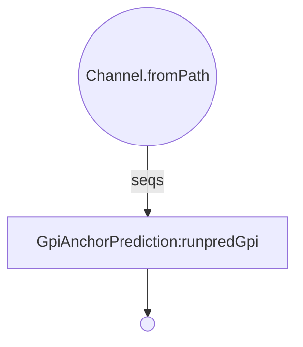

# Nextflow Conversion of repeatMaskerTask.pm

***
GpiAnchorPrediction
***  

### Get Started
  * Install Nextflow
    
    `curl https://get.nextflow.io | bash`
  
  * Run the script
    
    `nextflow run VEuPathDB/GpiAnchorPrediction -with-trace -c  <config_file> -r main`

### Description of nextflow configuration parameters:

| param         | value type        | description  |
| ------------- | ------------- | ------------ |
| inputFilePath | string| Path to the input fasta file. |
| outputDir | string | Where you would the the output file to be stored. |
| outputFormat | string <json,gff3> | Desired output format. |
